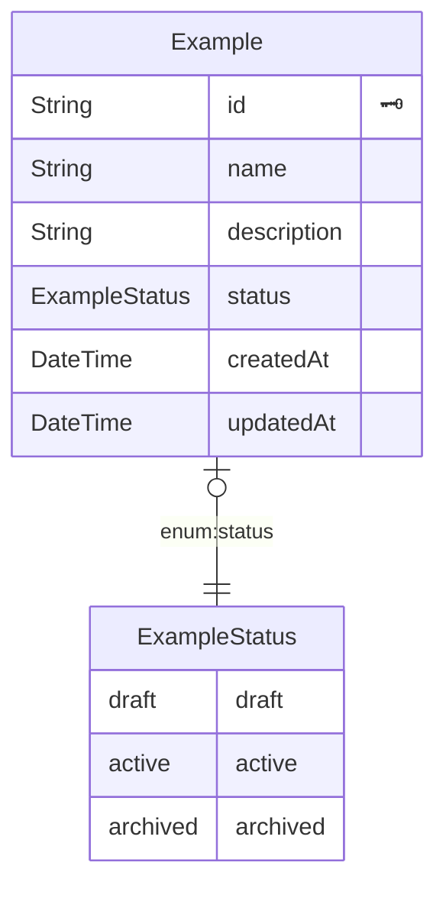

```mermaid
erDiagram

        ExampleStatus {
            draft draft
active active
archived archived
        }
    
  "Example" {
    String id "🗝️"
    String name 
    String description 
    ExampleStatus status 
    DateTime createdAt 
    DateTime updatedAt 
    }
  
    "Example" o|--|| "ExampleStatus" : "enum:status"
```
