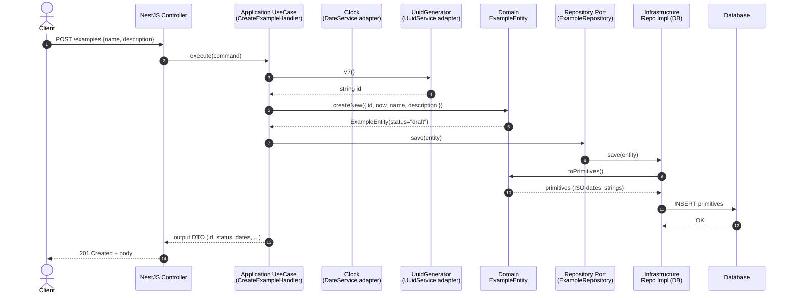
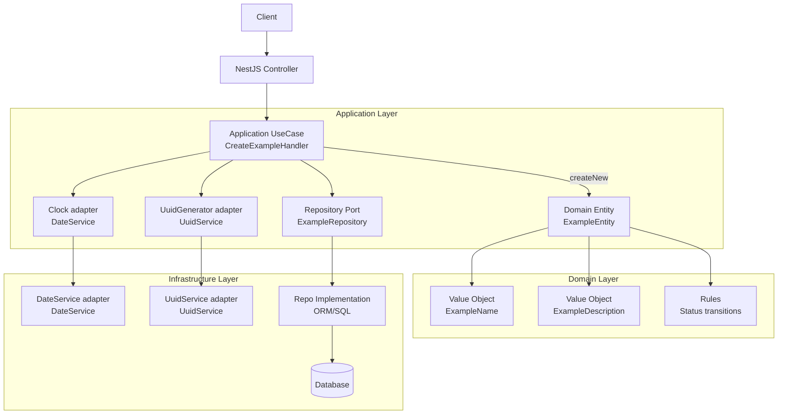

```mermaid
sequenceDiagram
  autonumber
  actor Client
  participant Controller as NestJS Controller
  participant UseCase as Application UseCase<br/>(CreateExampleHandler)
  participant Clock as Clock<br/>(DateService adapter)
  participant Uuid as UuidGenerator<br/>(UuidService adapter)
  participant Entity as Domain<br/>ExampleEntity
  participant Repo as Repository Port<br/>(ExampleRepository)
  participant RepoImpl as Infrastructure<br/>Repo Impl (DB)
  participant DB as Database

  Client->>Controller: POST /examples {name, description}
  Controller->>UseCase: execute(command)

  UseCase->>Uuid: v7()
  Uuid-->>UseCase: string id

  UseCase->>Entity: createNew({ id, now, name, description })
  Entity-->>UseCase: ExampleEntity(status="draft")

  UseCase->>Repo: save(entity)
  Repo->>RepoImpl: save(entity)
  RepoImpl->>Entity: toPrimitives()
  Entity-->>RepoImpl: primitives (ISO dates, strings)
  RepoImpl->>DB: INSERT primitives
  DB-->>RepoImpl: OK

  UseCase-->>Controller: output DTO (id, status, dates, ...)
  Controller-->>Client: 201 Created + body
```

```mermaid
flowchart TB
  Client[Client] --> C[NestJS Controller]
  C --> UC[Application UseCase<br/>CreateExampleHandler]

  subgraph App[Application Layer]
    UC --> Clock[Clock adapter<br/>DateService]
    UC --> Uuid[UuidGenerator adapter<br/>UuidService]
    UC -->|createNew | E[Domain Entity<br/>ExampleEntity]
    UC --> R[Repository Port<br/>ExampleRepository]
  end

  subgraph Domain[Domain Layer]
    E --> VO1[Value Object<br/>ExampleName]
    E --> VO2[Value Object<br/>ExampleDescription]
    E --> Rules[Rules<br/>Status transitions]
  end

  subgraph Infra[Infrastructure Layer]
    Clock --> DateService[DateService adapter<br/>DateService]
    Uuid --> UuidService[UuidService adapter<br/>UuidService]
    R --> RImpl[Repo Implementation<br/> ORM/SQL]
    RImpl --> DB[(Database)]
  end
```